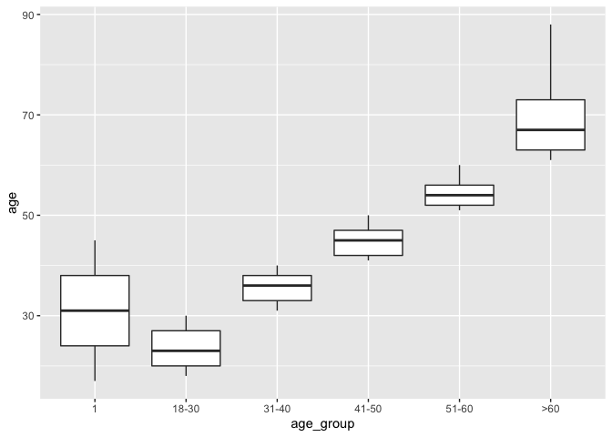
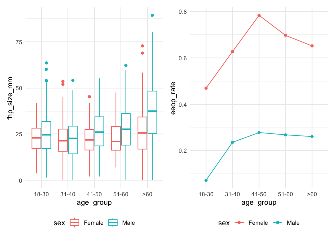
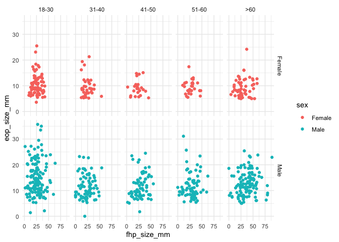
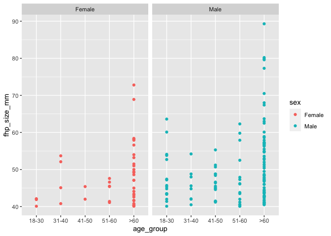

P8105 Midterm
================
AJ Catalano
11/18/2021

``` r
library(tidyverse)
```

    ## ── Attaching packages ─────────────────────────────────────── tidyverse 1.3.1 ──

    ## ✓ ggplot2 3.3.5     ✓ purrr   0.3.4
    ## ✓ tibble  3.1.5     ✓ dplyr   1.0.7
    ## ✓ tidyr   1.1.4     ✓ stringr 1.4.0
    ## ✓ readr   2.0.2     ✓ forcats 0.5.1

    ## ── Conflicts ────────────────────────────────────────── tidyverse_conflicts() ──
    ## x dplyr::filter() masks stats::filter()
    ## x dplyr::lag()    masks stats::lag()

``` r
library(magrittr)
```

    ## 
    ## Attaching package: 'magrittr'

    ## The following object is masked from 'package:purrr':
    ## 
    ##     set_names

    ## The following object is masked from 'package:tidyr':
    ## 
    ##     extract

## Problem 1

Import and clean the data. Format the data to use appropriate variable
names; fill in missing values with data where appropriate (as indicated
in the header information); create character and ordered factors for
categorical variables.

Briefly describe the data cleaning process and the resulting dataset,
identifying key variables based on your understanding of the original
scientific report. How many participants are included? What is the age
and gender distribution (a human-readable table may help here)?

Note (but don’t correct) issues in the available data – in particular,
whether categorical variables in the dataset correctly implement the
definitions based on underlying continuous variables. Use tables,
figures, or specific examples (i.e. data for particular subjects) as
needed to illustrate these issues.

``` r
# convert age_group, eop_size, eop_visibility_classification, (eop_shape - ), and fhp_category into factor variables

exostosis_data = 
  readxl::read_xlsx("./XLSX - Research Dataset.xlsx") |> 
  janitor::clean_names() |> 
  mutate(
    age_group = as.factor(age_group),
    age_group = recode(age_group,
                       "2" = "18-30", "3" = "31-40",
                       "4" = "41-50", "5" = "51-60", "6" = ">60",
                       "7" = ">60", "8" = ">60"),
    sex = recode(sex, "0" = "Female", "1" = "Male"),
    sex = as.factor(sex),
    eop_size = as.factor(eop_size),
    eop_visibility_classification = as.factor(eop_visibility_classification),
    fhp_category = as.factor(fhp_category),
    eop_shape = as.factor(eop_shape),
    eop_shape = ifelse(is.na(eop_shape), "None", eop_shape),
    eop_visibility_classification = as.factor(eop_visibility_classification)
  )

# eop_size_mm = ifelse(is.na(eop_size_mm), "<5", eop_size_mm)
```

``` r
# age gender distribution table

exostosis_data |> 
  filter(age_group != 1) |> 
  group_by(age_group) |> 
  count(sex) |> 
  pivot_wider(
    names_from = age_group,
    values_from = n
  ) |> 
  knitr::kable()
```

| sex    | 18-30 | 31-40 | 41-50 | 51-60 | \>60 |
|:-------|------:|------:|------:|------:|-----:|
| Female |   151 |   102 |   106 |    99 |  155 |
| Male   |   152 |   102 |   101 |   101 |  150 |

``` r
# There are two people in age_group 1. One observation is someone aged 17, while the other is 45. The 17 year old should not be included in the analysis as the paper states the age range is 18-86. The 45 year old should be in the 41-50 year-old age group.

exostosis_data |> 
  filter(age_group == 1)
```

    ## # A tibble: 2 × 9
    ##   sex      age age_group eop_size_mm eop_size eop_visibility_classifi… eop_shape
    ##   <fct>  <dbl> <fct>           <dbl> <fct>    <fct>                    <chr>    
    ## 1 Female    17 1                 6.4 1        2                        1        
    ## 2 Male      45 1                NA   0        0                        None     
    ## # … with 2 more variables: fhp_size_mm <dbl>, fhp_category <fct>

``` r
exostosis_data |> 
  ggplot(aes(x = age_group, y = age)) +
  geom_boxplot()
```

<!-- -->

``` r
# eop_size appears to be categorical, but there is one observation with a value of 14.6 that is does not appear to follow eop_size coding categories.

unique(exostosis_data$eop_size)
```

    ## [1] 2    3    0    4    1    5    14.6
    ## Levels: 0 1 14.6 2 3 4 5

``` r
exostosis_data |> 
  count(eop_size) |> 
  pivot_wider(
    names_from = eop_size,
    values_from = n
  ) |> 
  knitr::kable()
```

|   0 |   1 | 14.6 |   2 |   3 |   4 |   5 |
|----:|----:|-----:|----:|----:|----:|----:|
| 522 | 305 |    1 | 227 | 109 |  48 |   9 |

## Problem 2

In the original scientific report, Figures 3 and 4 show data or derived
quantities. Both are flawed. Figure 3 shows only the mean and standard
deviation for FHP, but does not show the distribution of the underlying
data. Figure 4 shows the number of participants in each age and sex
group who have an enlarged EOP (based on categorical EOP Size – groups 0
and 1 vs groups 2, 3, 4, and 5). However, the number of participants in
each age and sex group was controlled by the researchers, so the number
with enlarged EOP in each group is not as informative as the rate of
enlarged EOP in each group. Create a two-panel figure that contains
improved versions of both of these.

``` r
age_distribution = 
  exostosis_data |> 
  filter(age_group != 1) |> 
  ggplot(aes(x = age_group, y = fhp_size_mm, color = sex)) +
  geom_boxplot() +
  theme_minimal() +
  theme(legend.position = "bottom")

eeop_rate = 
  exostosis_data |> 
  filter(age_group != 1) |> 
  group_by(age_group, sex) |> 
  summarize(
    eeop_rate = sum(is.na(eop_size_mm)) / (sum(!is.na(eop_size_mm)) + sum(is.na(eop_size_mm)))
  ) |> 
  ggplot(aes(x = age_group, y = eeop_rate, color = sex, group = sex)) +
  geom_point() +
  geom_line() +
  theme_minimal() +
  theme(legend.position = "bottom")
```

    ## `summarise()` has grouped output by 'age_group'. You can override using the `.groups` argument.

``` r
patchwork::wrap_plots(age_distribution, eeop_rate)
```

    ## Warning: Removed 6 rows containing non-finite values (stat_boxplot).

<!-- -->

Although the authors are interested in how FHP size, age, and sex affect
EOP size, no figure contains each of these. Create a 2 x 5 collection of
panels, which show the association between FHP size and EOP size in each
age and sex group.

Comment on your plots with respect to the scientific question of
interest.

``` r
exostosis_data |> 
  filter(age_group != 1) |> 
  group_by(sex, age_group) |> 
  ggplot(aes(x = fhp_size_mm, eop_size_mm, color = sex)) +
  geom_point() +
  facet_grid(sex ~ age_group) +
  theme_minimal()
```

    ## Warning: Removed 522 rows containing missing values (geom_point).

<!-- -->

The authors’ stated sample sizes do not agree with the available data.

``` r
# Quoted from article: "Numbers of participants in each age group was: 18–30 n = 300, 31–40 n = 200, 41–50 n = 200, 51–60 n = 200 and >60 n = 300"

actual_sample_size =
  exostosis_data |> 
  group_by(age_group) |> 
  count()

reported_sample_size = 
  tibble(
    age_group = c("<18", "18-30", "31-40", "41-50", "51-60", ">60"),
    reported_n = c(0, 300, 200, 200, 200, 300)
  )

sample_comparison =
  left_join(actual_sample_size, reported_sample_size)
```

    ## Joining, by = "age_group"

``` r
sample_comparison |> 
  knitr::kable()
```

| age_group |   n | reported_n |
|:----------|----:|-----------:|
| 1         |   2 |         NA |
| 18-30     | 303 |        300 |
| 31-40     | 204 |        200 |
| 41-50     | 207 |        200 |
| 51-60     | 200 |        200 |
| \>60      | 305 |        300 |

Neither the mean nor the standard deviation for fhp size is consistent
with the reported data for either gender.

``` r
# The mean FHP in the male cases examined was 28± 15 mm, while that for the female cases was 24± 11mm (P < 0.001).

exostosis_data |> 
  group_by(sex) |> 
  summarize(
    mean_fhp_size = mean(fhp_size_mm, na.rm = TRUE),
    mean_fhp_size_sd = sd(fhp_size_mm, na.rm = TRUE)
  ) |>
  knitr::kable()
```

| sex    | mean_fhp_size | mean_fhp_size_sd |
|:-------|--------------:|-----------------:|
| Female |      23.72580 |         10.61789 |
| Male   |      28.51234 |         14.66670 |

The authors find “the prevalence of EEOP to be 33% of the study
population”. What is the definition of EEOP, and what variables can you
use to evaluate this claim? Is the finding consistent with the data
available to you?

``` r
# Enlarged external occipital protuberance (EEOP) is defined as EOP > 10mm.

exostosis_data |> 
  summarize(
    eeop_prevalence = sum(is.na(eop_size_mm)) / (sum(!is.na(eop_size_mm)) + sum(is.na(eop_size_mm)))
  )
```

    ## # A tibble: 1 × 1
    ##   eeop_prevalence
    ##             <dbl>
    ## 1           0.424

FHP is noted to be more common in older subjects, with “FHP \>40 mm
observed frequently (34.5%) in the over 60s cases”. Are the broad trends
and specific values consistent with your data?

``` r
exostosis_data |> 
  filter(age_group != 1,
         fhp_size_mm > 40) |> 
  group_by(age_group) |> 
  ggplot(aes(x = age_group, y = fhp_size_mm, color = sex)) +
  geom_point() +
  facet_grid(. ~ sex)
```

<!-- -->

``` r
exostosis_data |> 
  filter(age_group != 1) |> 
  group_by(age_group) |> 
  summarize(
    "fhp_>40" = (100 * mean(fhp_size_mm > 40, na.rm = TRUE)),
    ) |> 
  knitr::kable()
```

| age_group | fhp\_\>40 |
|:----------|----------:|
| 18-30     |  6.666667 |
| 31-40     |  5.911330 |
| 41-50     |  8.695652 |
| 51-60     | 11.055276 |
| \>60      | 32.565790 |
